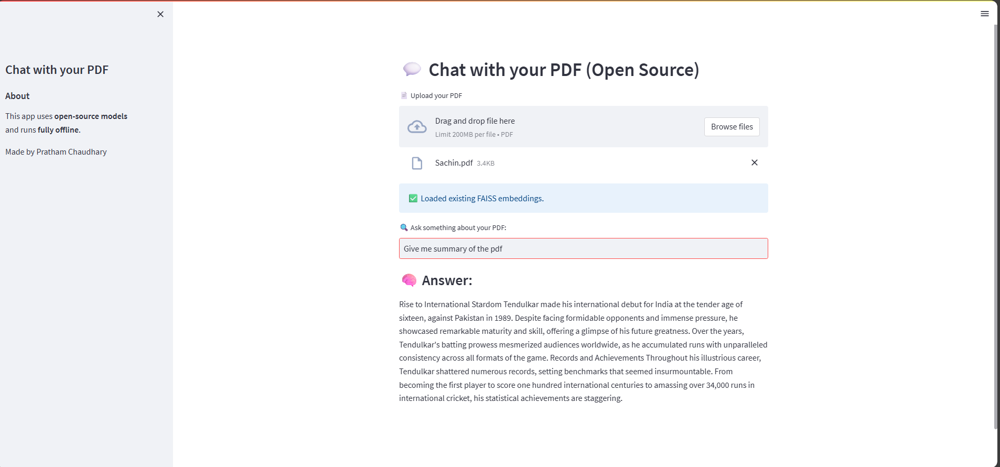

# 📄 Chat with PDF

Chat with PDF is an intelligent application that allows users to **upload PDF files and interact with their contents through natural language**.  
It uses **AI-powered language models** to understand your queries and provide accurate, contextual answers from within your documents.

---

## 🚀 Features

- 📚 Upload and process any PDF file  
- 💬 Ask questions and get precise answers from the text  
- ⚡ Fast, interactive, and easy-to-use web interface  
- 🧠 Built using modern AI and NLP techniques  
- 🌐 Powered by `app.py` (Flask / Streamlit / FastAPI, depending on your implementation)

---

## 🖼️ Project Preview

Here’s a quick look at the interface:

